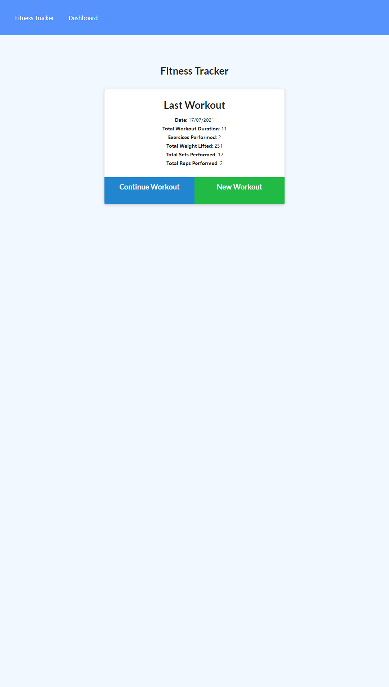
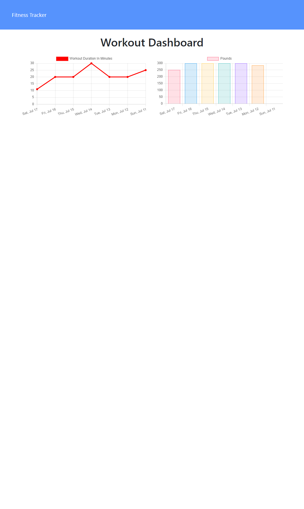
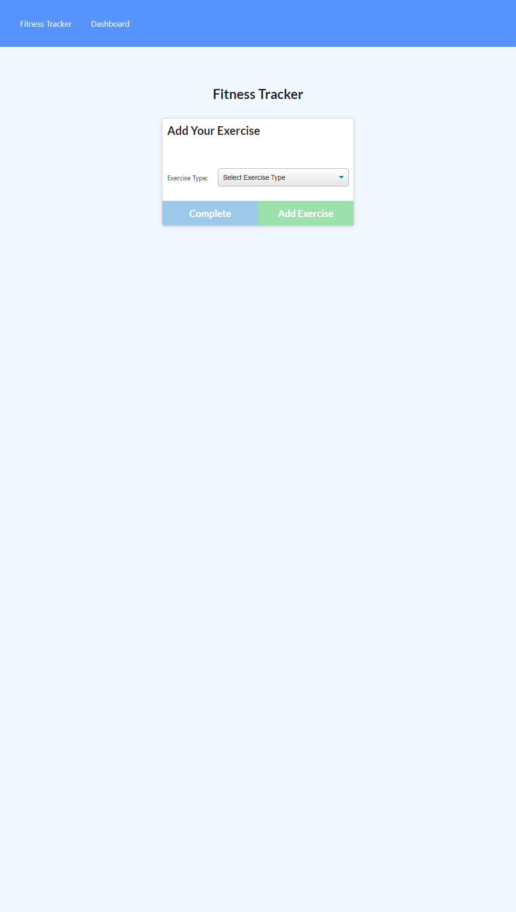
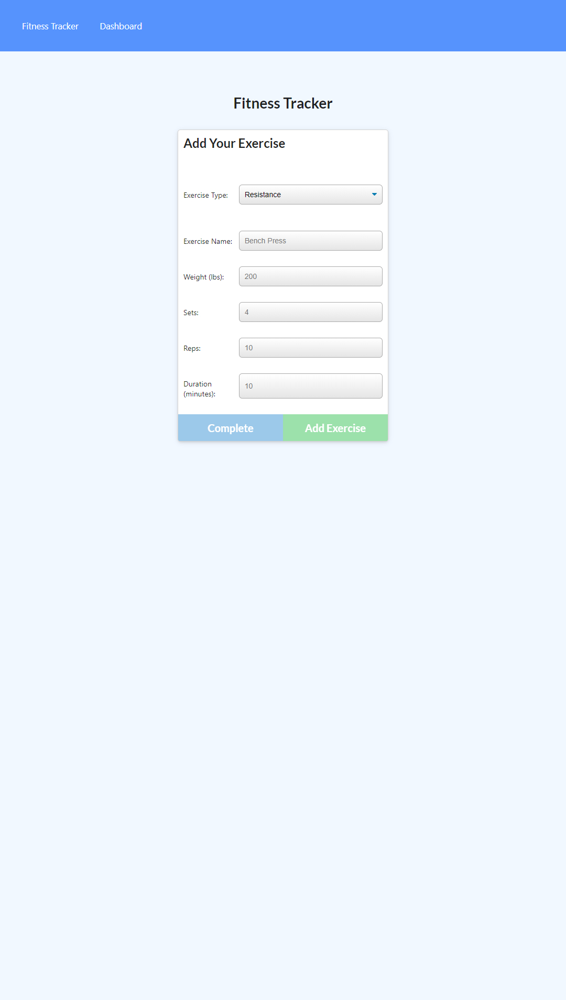
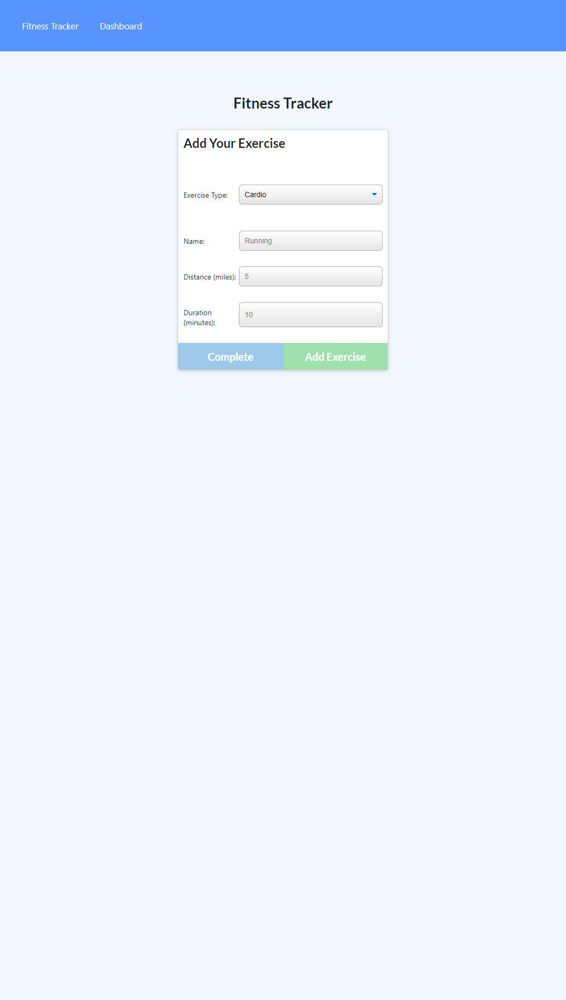

# workout-tracker


## deployed url

https://frozen-falls-54533.herokuapp.com/

## Table of Contents

- [workout-tracker](#workout-tracker)
  - [deployed url](#deployed-url)
  - [Table of Contents](#table-of-contents)
  - [Description](#description)
  - [Installation](#installation)
  - [Usage](#usage)
  - [License](#license)
  - [Contributing](#contributing)
  - [Tests](#tests)
  - [screenshots](#screenshots)

## Description

I've been tasked with making a workout tracker that tracks your daily workouts and adds them to a database.
and shows your progression through a graph over a 7 day period.
which also shows your last workout on the landing page.

## Installation

```
git clone git@github.com:Cratesy/workout-tracker.git
cd workout-tracker
npm install
```

## Usage

As a user, i am greeted by the landing page which i can create a new workout by clicking the new workout button.
when i click the new workout button im greeted with a add your exercise box. inside this box it has exercise type field which you can pick from either "resistance" or "cardio".
when you click resistance/cardio your greeted by a exercise form which is constructed towards resistance/cardio workouts. That asks you to input a list of workout attributes.
once completing this form it will add it to your current workout.

as a user, i can continue workout if ive already started one by clicking the continue workout button.
once clicking the continue button you are then able to create more workouts for that day.
you can also click complete which completes the workouts for that current day.

as a user, i can access my dashboard which will give me a 7 day forcast of all my workouts i complete within the 7 days which will be in graph form.

## License

[MIT License](https://opensource.org/licenses/MIT)

## Contributing

[Mike](https://github.com/Cratesy)

## Tests

None were need

## screenshots






